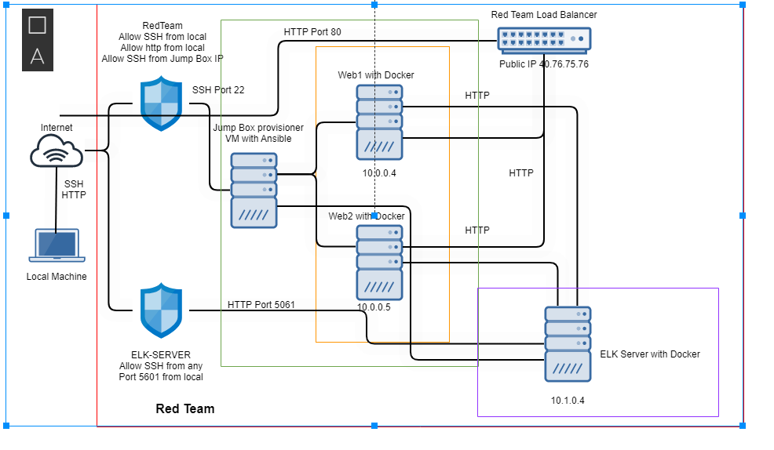

## Automated ELK Stack Deployment

The files in this repository were used to configure the network depicted below.

These files have been tested and used to generate a live ELK deployment on Azure. They can be used to either recreate the entire deployment pictured above. Alternatively, select portions of the playbook file may be used to install only certain pieces of it, such as Filebeat.

  - _TODO: Enter the playbook file._

This document contains the following details:
- Description of the Topology
- Access Policies
- ELK Configuration
  - Beats in Use
  - Machines Being Monitored
- How to Use the Ansible Build

### Description of the Topology - The main purpose of this network is to expose a load-balanced and monitored instance of DVWA, the D*mn Vulnerable Web Application.
Load balancing ensures that the application will be highly available, in addition to restricting access to the network.

The main purpose of this network is to expose a load-balanced and monitored instance of DVWA, the D*mn Vulnerable Web Application.

Load balancing ensures that the application will be highly available, in addition to restricting access to the network.
- _TODO: What aspect of security do load balancers protect? What is the advantage of a jump box?
   * A jumpbox server serves as a gateway to gain entry into a remote network. Many times the primary mode of access is ssh and without the key access is forbidden.
   * A loadbalancer is meant to serves as a specific point of access for a service that is served by multiple machines. This allows high availability models to function properly.

Integrating an ELK server allows users to easily monitor the vulnerable VMs for changes to the log files and system resources.
- _TODO: What does Filebeat watch for? Filebeat is meant to primarily to watch for system logs and forward any changes to the Elasticsearch Host.
   *Filebeat is meant primarly to watch for system logs
- _TODO: What does Metricbeat record? Metricbeat is used only for gathering metrics and system resources usage for display in Elasticsearch.
   *Metricbeat is used only for gathering metrics and system reources usage for display. 

The configuration details of each machine may be found below.
_Note: Use the [Markdown Table Generator](http://www.tablesgenerator.com/markdown_tables) to add/remove values from the table_.

| Name     | Function | IP Address | Operating System |
|----------|----------|------------|------------------|
| Jump Box | Gateway  | 10.0.0.1     | Ubuntu           |
| Web1     | Webserver| 10.0.0.4     | Ubuntu           |
| Web2     | Webserver| 10.0.0.5     | Ubuntu           |
| Elk      | ElasticSearch| 10.1.0.4 | Ubuntu           |
### Access Policies

The machines on the internal network are not exposed to the public Internet. 

Only the jumpbox machine can accept connections from the Internet. Access to this machine is only allowed from the following IP addresses:
- _TODO: Add whitelisted IP addresses_ 75.118.203.288

Machines within the network can only be accessed by Jumpbox Provisioner.
- _TODO: Which machine did you allow to access your ELK VM? What was its IP address?_Jumpbox PrivateIP:10.1.0.4 PublicIP:40.76.137.147

A summary of the access policies in place can be found in the table below.

| Name     | Publicly Accessible | Allowed IP Addresses |
|----------|---------------------|----------------------|
| Jump Box | SSH - 22 Yes        | 75.118.203.288       |
| Web 1,2  | No                  | Web LB 40.76.75.76   |
| ELK      | Kibana - 5601 - Yes |                      |

### Elk Configuration

Ansible was used to automate configuration of the ELK machine. No configuration was performed manually, which is advantageous because...
- _TODO: What is the main advantage of automating configuration with Ansible? There are several benefits of using Ansible, especially if you are handling multiple servers. Ansible allows you to configure a large amount of servers in a precise and fast fashion. Ansible is agentless, meaning that there’s no requirement for an agent to be installed on the server. It uses ssh and python to establish connections with the server instead. Because of this you are able to save a lot of space. This also leads to reduced latency. Ansible is also user-friendly, it uses YAML, making it easy to understand.

The playbook implements the following tasks:
- _TODO: In 3-5 bullets, explain the steps of the ELK installation play. E.g., install Docker; download image; etc._
•	Config Elk VM with Docker
•	Install Docker.io
•	Install Python-pip
•	Increase Virtual Memory
•	Download and launch ELK Docker container

The following screenshot displays the result of running `docker ps` after successfully configuring the ELK instance.

 

### Target Machines & Beats
This ELK server is configured to monitor the following machines:
- _TODO: List the IP addresses of the machines you are monitoring 10.0.0.4, 10.0.0.5 and 10.0.0.6

We have installed the following Beats on these machines:
- _TODO: Specify which Beats you successfully installed - Filebeat and Metricbeat.

These Beats allow us to collect the following information from each machine:
- _TODO: In 1-2 sentences, explain what kind of data each beat collects, and provide 1 example of what you expect to see. E.g., `Winlogbeat` collects Windows logs, which we use to track user logon events, etc._
-  Filebeat monitors the log files or locations that you specify, collects log events, and forwards them either to Elasticsearch or Logstash for indexing.
- Metricbeat collects metric data from your target servers, this could be operating system metrics such as CPU or memory or data related to services running on the server. It can also be used to monitor other beats and ELK stack itself.

### Using the Playbook
In order to use the playbook, you will need to have an Ansible control node already configured. Assuming you have such a control node provisioned: 

SSH into the control node and follow the steps below:
- Copy the config file to run playbook.
- Update the ansible host file to include...
- Run the playbook, and navigate to Jumpbox to check that the installation worked as expected.

_TODO: Answer the following questions to fill in the blanks:
- _Which file is the playbook? Where do you copy it? - Elk-playbook.yml
- _Which file do you update to make Ansible run the playbook on a specific machine? How do I specify which machine to install the ELK server on versus which to install Filebeat on?
Update the hosts file or the ansible.cfg.
- _Which URL do you navigate to in order to check that the ELK server is running? http://thatdaysipaddress:5601/app/kibana

_As a **Bonus**, provide the specific commands the user will need to run to download the playbook, update the files, etc._
